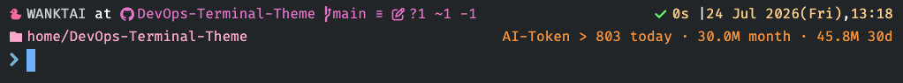
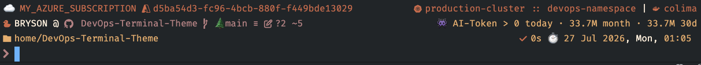
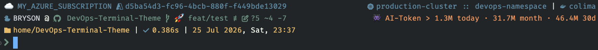

# DevOps Daily Oh-My-Posh Theme

## Installation

- Prerequisite: Install [Oh-My-Posh - For Linux](https://ohmyposh.dev/docs/installation/linux) here
- Install [Nerd Font](https://www.nerdfonts.com/font-downloads), I am using `FiraCode Nerd Font`. Make sure to set this font to your terminal, else you will see `?` like logo.
- Copy the theme configuration YAML into your local terminal, suggested to put into `../bin/oh-my-posh/custom/themes/devops-daily.omp.yaml`.
- Add command below into `.zshrc`. Change `--config` path refer to your local theme configuration YAML.
    ```bash
    eval "$(oh-my-posh init zsh --config '../oh-my-posh/custom/themes/devops-daily.omp.yaml')"
    ```

## Features

- SSH Session
- Git & Remote Info
- Execution Time
- Date & Time
- Directory Path
- AI-Token Usage
  - Integrated with [AI-Engineering-Fluency](https://github.com/rajbos/ai-engineering-fluency)
- Programming Language
  - Python Env
- DevOps Workspace Tooltips (Require CLI)
  - Helm Version

## Themes

- [Pink Duck](./themes/pink-duck.yaml)
  
- [Autumn Ember](./themes/autumn-ember.yaml)
  
- [Forest Tide](./themes/forest-tide.yaml)
  
